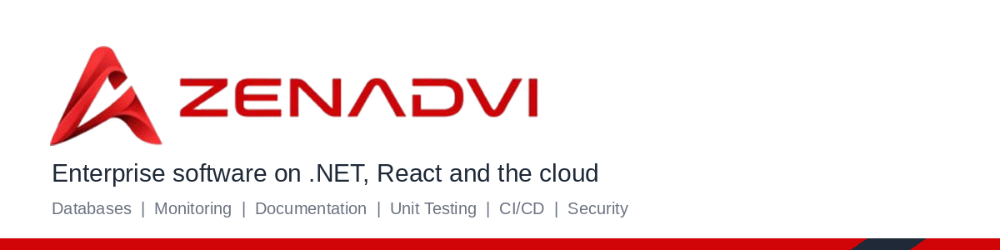

## 👋 About Zenadvi

We build reliable, scalable enterprise software with **.NET** and **React**, deployed on **AWS** and **Azure**, and we work with the database our clients already run.

## 🛠️ Stack we work in

| Category | Technologies |
|----------|--------------|
| **Backend** | .NET 8, .NET 10, ASP.NET Core, EF Core, Worker Services |
| **Frontend** | React, TypeScript, Vite |
| **Databases** | SQL Server, Oracle, MySQL, MariaDB, PostgreSQL, Cosmos DB |
| **Cloud** | AWS, Azure |
| **Messaging & Serverless** | RabbitMQ, Azure Service Bus, Azure Functions |
| **DevOps** | Docker, GitHub Actions, CI/CD |

## ✅ What's included in every template

- **Databases:** configurable provider, migrations and seed data
- **Monitoring:** structured logging, health checks and tracing
- **Documentation:** README, setup guide and architecture diagram
- **Unit testing:** test project with sample tests
- **CI/CD:** GitHub Actions build, test and deploy pipeline
- **Security:** authentication, secrets kept out of code, dependency scanning

## 📦 Starter templates

| Template | Description |
|----------|-------------|
| [zenadvi-api-template](https://github.com/zenadvi/zenadvi-api-template) | .NET Web API with Clean Architecture, JWT auth and OpenAPI docs |
| [zenadvi-react-template](https://github.com/zenadvi/zenadvi-react-template) | React + TypeScript starter wired to the API template |
| [zenadvi-job-template](https://github.com/zenadvi/zenadvi-job-template) | .NET background job/scheduler starter |
| [zenadvi-service-template](https://github.com/zenadvi/zenadvi-service-template) | .NET messaging/background service starter |

Click **Use this template** on any repo to start a new project.

## 🤝 Work with us

- 🌐 Website: https://zenadvi.com
- 📧 Email: hello@zenadvi.com

_Have a project in mind? Get in touch._
